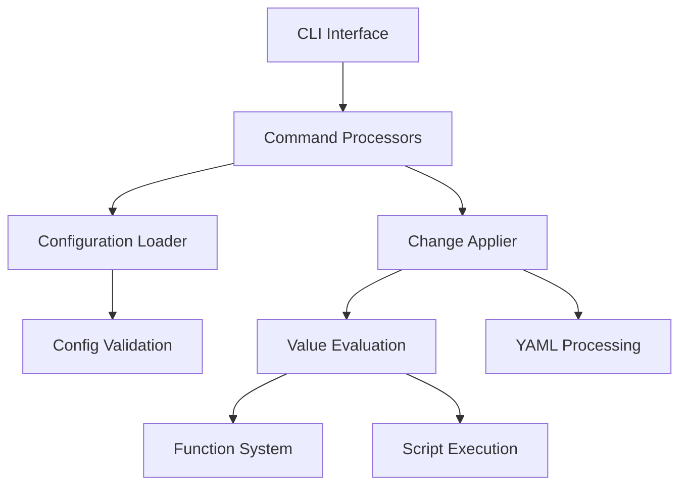

# Architecture

Overview of Genifest's internal architecture and design decisions.

!!! note "Work in Progress"
    This documentation page is being developed. Please check back soon for complete content.

## System Overview

Genifest follows a modular architecture with clear separation of concerns:



## Core Components

### CLI Layer (`internal/cmd/`)

**Subcommand Architecture**:
- `root.go` - Main command dispatcher
- `run.go` - Core functionality for applying changes
- `tags.go` - Tag listing and management
- `validate.go` - Configuration validation
- `config.go` - Configuration display
- `version.go` - Version information
- `common.go` - Shared utilities

**Key Features**:
- Directory argument support
- Enhanced progress reporting
- Tag filtering logic
- Error handling with context

### Configuration System (`internal/config/`)

**Metadata-Driven Loading**:
- Starts with root `genifest.yaml`
- Discovers additional configs through metadata
- Creates synthetic configs for directories without explicit configs
- Validates function references and path security

**Core Types**:
- `Config` - Main configuration structure
- `MetaConfig` - Metadata for discovery
- `PathContext` - Path with context information
- `ChangeOrder` - Change definitions
- `FunctionDefinition` - Reusable functions
- `ValueFrom` - Union type for value sources

### Value Evaluation (`internal/changes/`)

**EvalContext System**:
- Immutable context carrying current state
- File and document context awareness
- Variable scoping and isolation
- Function resolution and execution

**Evaluators**:
- `DefaultValue` - Literal values
- `ArgumentRef` - Variable references
- `BasicTemplate` - String templates
- `FunctionCall` - Function execution
- `ScriptExec` - External script execution
- `FileInclusion` - File content inclusion
- `DocumentRef` - Document field references
- `CallPipeline` - Multi-step processing

### Change Application

**Document Processing**:
- Multi-document YAML handling
- Key selector path navigation
- Atomic file operations
- Change tracking and reporting

**File Selector Matching**:
- Glob pattern support
- Path-aware matching
- Security boundary enforcement

## Design Decisions

### Immutable Contexts

**Rationale**: Prevents side effects and enables safe concurrent use

**Implementation**:
```go
func (ctx *EvalContext) WithVariable(name, value string) *EvalContext {
    newCtx := *ctx
    newVars := make(map[string]string)
    for k, v := range ctx.Variables {
        newVars[k] = v
    }
    newVars[name] = value
    newCtx.Variables = newVars
    return &newCtx
}
```

### Metadata-Driven Discovery

**Rationale**: Flexible project organization without rigid structure requirements

**Benefits**:
- Projects can organize files naturally
- Configurations stay close to managed files
- Automatic discovery reduces configuration burden

### Function Scoping

**Rationale**: Prevents naming conflicts and ensures proper encapsulation

**Rules**:
- Functions are available in their definition directory and children
- Root functions are globally available
- Child functions can override parent functions

### Security Model

**CloudHome Boundary**:
- All file operations must stay within cloudHome
- Path traversal prevention
- Script execution isolation

**Script Security**:
- Scripts must be in designated directories
- Working directory is always cloudHome
- Environment variable isolation

## Key Patterns

### Error Handling

**Contextual Errors**:
```go
if err != nil {
    return fmt.Errorf("failed to process file %s: %w", filePath, err)
}
```

**User-Friendly Messages**:
- Distinguish configuration errors from system errors
- Provide actionable guidance
- Include relevant context

### YAML Processing

**Multi-Document Support**:
- Handle files with multiple YAML documents
- Preserve document structure and formatting
- Atomic write operations

**Key Selector Navigation**:
- Support for nested field access
- Array indexing with `[n]` syntax
- Complex path resolution

### Testing Strategy

**Integration Tests**:
- End-to-end testing with real configurations
- Guestbook example as test fixture
- Context immutability verification

**Unit Tests**:
- Individual ValueFrom evaluator testing
- Error condition coverage
- Edge case validation

## Performance Considerations

### Memory Efficiency

- Process files individually rather than loading entire project
- Lazy evaluation of ValueFrom expressions
- Efficient YAML parsing and modification

### File I/O Optimization

- Batch file operations where possible
- Only write files when changes are actually made
- Atomic operations to prevent corruption

## Extension Points

The architecture supports future extensions:

### Custom ValueFrom Types

New value generation methods can be added by:
1. Extending the `ValueFrom` union type
2. Adding evaluator function
3. Updating validation logic

### Plugin System

Future plugin support could provide:
- Custom functions
- External value sources
- Integration with external systems

## See Also

- [Contributing](contributing.md) - Development guidelines
- [Testing](testing.md) - Testing approach
- [Core Concepts](../user-guide/concepts.md) - User-facing concepts