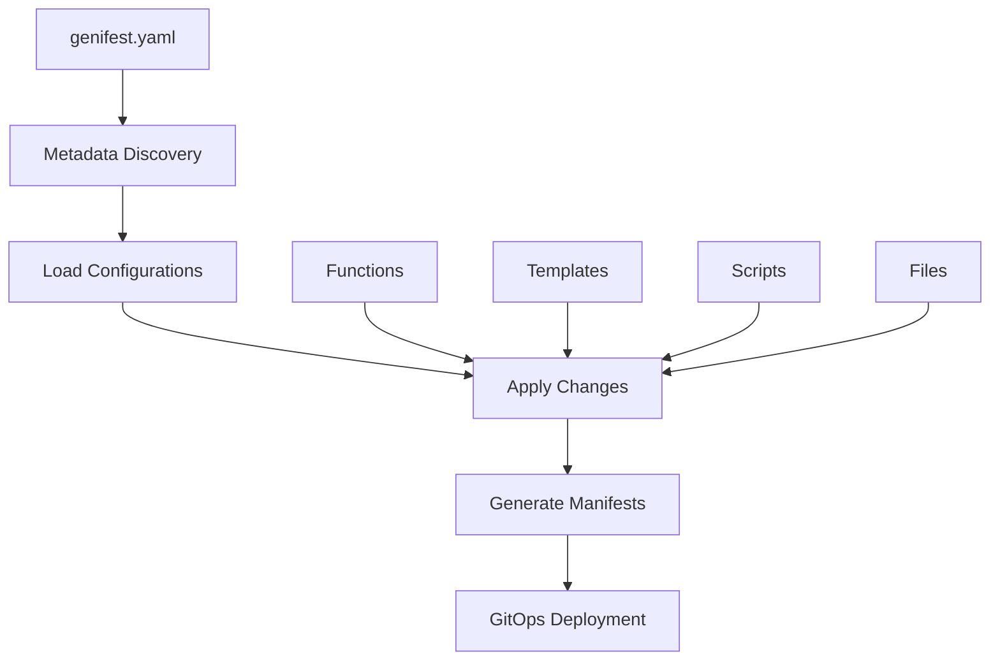

# Genifest

!!! warning "Alpha Software"
    This is alpha software under active development. APIs and configuration formats may change without notice.

**Genifest** is a Kubernetes manifest generation tool that creates deployment manifests from templates for GitOps workflows. It processes configuration files to generate Kubernetes resources with dynamic value substitution, designed for use with GitOps continuous deployment processes like ArgoCD.

## Key Features

- 🔄 **Metadata-Driven Discovery**: Automatically discovers configurations through directory structures
- 🎯 **Dynamic Value Generation**: Multiple ways to generate values (functions, templates, scripts, files)
- 🏷️ **Tag-Based Filtering**: Apply different sets of changes based on environment or type tags
- 📁 **Hierarchical Configuration**: Distributed configs that keep changes close to files
- 🎛️ **Advanced Path Expressions**: yq-style keySelectors with grammar-based parsing
- 🔒 **Security & Safety**: Path validation, isolated execution, scoped changes, GitOps-ready
- 🚀 **CLI-First Design**: Subcommand-based architecture with enhanced progress reporting

## How It Works

Genifest uses a metadata-driven approach to discover and process YAML configuration files. It applies dynamic changes to Kubernetes manifests and related configuration files based on configurable rules, allowing you to maintain a single set of manifests that evolve over time.



## Use Cases

- **Environment-Specific Deployments**: Generate different configurations for dev, staging, production
- **Secret Management**: Embed secrets and sensitive data dynamically  
- **Image Tag Management**: Update container image tags based on business rules
- **Configuration Variations**: Manage variations in configuration files across environments
- **GitOps Workflows**: Single source of truth that works seamlessly with ArgoCD, Flux, etc.

## Quick Start

=== "Install"

    ```bash
    # Install from GitHub releases
    curl -L https://raw.githubusercontent.com/zostay/genifest/master/tools/install.sh | sh
    
    # Or install from source
    go install github.com/zostay/genifest/cmd/genifest@latest
    ```

=== "Basic Usage"

    ```bash
    # Apply all changes
    genifest run
    
    # Apply only production changes  
    genifest run --include-tags production
    
    # Show available tags
    genifest tags
    
    # Validate configuration
    genifest validate
    ```

=== "Example Config"

    ```yaml
    metadata:
      cloudHome: "."
      paths:
        - path: "k8s"
          files: true
          depth: 0
        - path: "scripts"
          scripts: true
          depth: 0
    
    functions:
      - name: "get-replicas"
        params:
          - name: "environment"
            required: true
        valueFrom:
          script:
            exec: "get-replicas.sh"
            args:
              - name: "environment"
                valueFrom:
                  argRef:
                    name: environment
    
    changes:
      - tag: "production"
        fileSelector: "*-deployment.yaml"
        keySelector: ".spec.replicas"
        valueFrom:
          call:
            function: "get-replicas"
            args:
              - name: "environment"
                valueFrom:
                  default:
                    value: "production"
    ```

## Architecture Overview

### Configuration Structure

Genifest uses a hierarchical configuration approach:

1. **Root Configuration**: A `genifest.yaml` file in your project root defines metadata paths and global settings
2. **Distributed Configurations**: Additional `genifest.yaml` files in subdirectories provide scoped configurations  
3. **Automatic Discovery**: Directories without explicit configurations get synthetic configs containing all YAML files

### Value Generation System

Multiple ways to generate dynamic values:

- **DefaultValue**: Literal string values
- **ArgumentRef**: References to variables from evaluation context
- **BasicTemplate**: Template strings with `${variable}` substitution
- **FunctionCall**: Calls to named functions with arguments
- **ScriptExec**: Executes scripts from scripts directory
- **FileInclusion**: Includes content from files directory
- **CallPipeline**: Chains multiple operations together

## Next Steps

<div class="grid cards" markdown>

-   :material-clock-fast:{ .lg .middle } **Quick Start**

    ---

    Get up and running with Genifest in minutes

    [:octicons-arrow-right-24: Getting Started](getting-started/installation.md)

-   :material-book-open-page-variant:{ .lg .middle } **User Guide**

    ---

    Learn core concepts and advanced features

    [:octicons-arrow-right-24: User Guide](user-guide/concepts.md)

-   :material-file-document-multiple:{ .lg .middle } **Examples**

    ---

    Follow along with real-world examples

    [:octicons-arrow-right-24: Examples](examples/guestbook.md)

-   :material-api:{ .lg .middle } **Reference**

    ---

    Complete API and configuration reference

    [:octicons-arrow-right-24: Reference](reference/schema.md)

</div>

## Community

- **GitHub**: [zostay/genifest](https://github.com/zostay/genifest)
- **Issues**: [Bug Reports & Feature Requests](https://github.com/zostay/genifest/issues)
- **Discussions**: [Community Forum](https://github.com/zostay/genifest/discussions)

## License

Genifest is open source software licensed under the [MIT License](https://github.com/zostay/genifest/blob/master/LICENSE).

---

*Copyright © 2025 Qubling LLC*