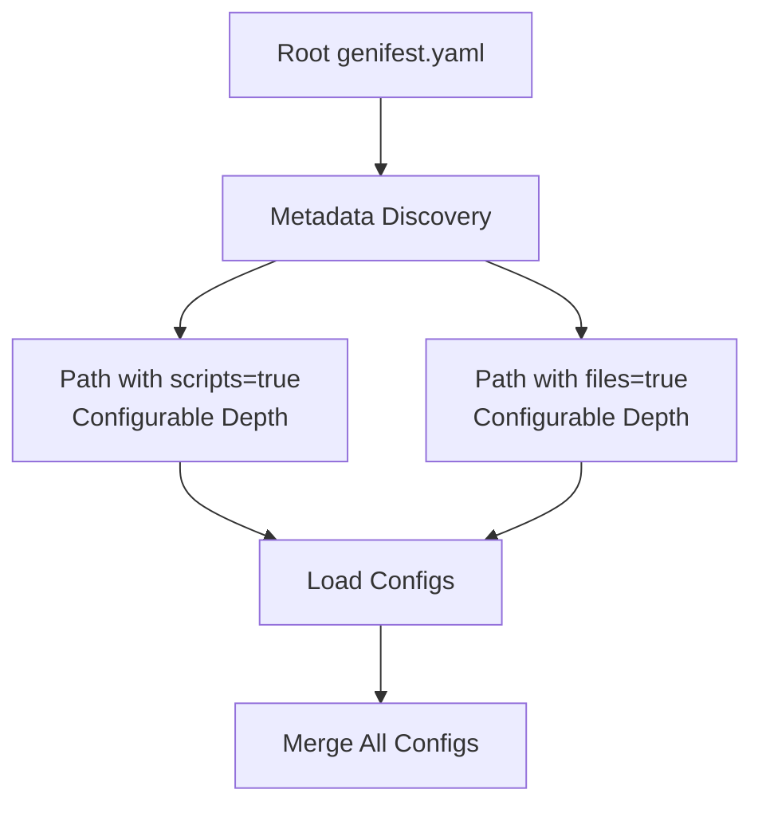

# Core Concepts

Genifest is built around several key concepts that work together to provide a flexible and powerful manifest generation system.

Note that while this system is specifically oriented toward Kubernetes manifest generation, it is not actually limited to that use-case. The system itself is just a tool for modifying configuration files. It does not actually care if those files are Kubernetes manifests or not.

## Configuration Discovery

Genifest uses a **metadata-driven approach** to discover and load configuration files throughout your project.

### Discovery Process

1. **Root Discovery**: Starts by loading the root `genifest.yaml` file
2. **Metadata Processing**: Uses unified `paths` configuration to discover additional directories
3. **Recursive Loading**: Loads configurations from discovered directories with depth limits
4. **Synthetic Configs**: Creates automatic configurations for directories without explicit `genifest.yaml` files



### Configurable Directory Depths

Each path in the metadata can specify its own depth limit:

- **Depth 0**: Only the specified directory (single level)
- **Depth 1**: One level deep (directory + subdirectories)
- **Depth N**: N levels deep into the directory tree

**Default Depth**: 0 (single level only)

**Example Configuration**:
```yaml
metadata:
  paths:
    - path: "scripts"
      scripts: true
      depth: 0           # Single level only
    - path: "manifests"
      files: true
      depth: 1           # Go one level deep (manifests/app/)
    - path: "files"
      files: true
      depth: 2           # Go two levels deep (files/category/app/)
```

The typical pattern is that manifests and files will be organized as `<root>/<app>` structures, while scripts are usually kept at a single level.

## Value Generation System

The heart of Genifest is its flexible value generation system using **ValueFrom** expressions.

### ValueFrom Types

=== "DefaultValue"

    Returns literal string values:
    ```yaml
    valueFrom:
      default:
        value: "literal-string"
    ```

=== "EnvironmentRef"

    Reads values from environment variables with optional defaults:
    ```yaml
    valueFrom:
      envRef:
        name: "DATABASE_URL"
        default: "postgresql://localhost:5432/myapp"  # Optional
    ```

=== "DocumentRef"

    References values from other locations within the current YAML document (or other files or documents when combined with fileSelector and documentSelector):
    ```yaml
    valueFrom:
      documentRef:
        keySelector: ".metadata.name"
    ```

=== "ArgumentRef"

    References variables from the current evaluation context:
    ```yaml
    valueFrom:
      argRef:
        name: "variable-name"
    ```

=== "BasicTemplate"

    Template strings with `${variable}` substitution:
    ```yaml
    valueFrom:
      template:
        string: "Hello ${name}!"
        variables:
          - name: "name"
            valueFrom:
              default:
                value: "World"
    ```

=== "FunctionCall"

    Calls named functions with arguments:
    ```yaml
    valueFrom:
      call:
        function: "get-replicas"
        args:
          - name: "environment"
            valueFrom:
              default:
                value: "production"
    ```

=== "ScriptExec"

    Executes scripts from the scripts directory:
    ```yaml
    valueFrom:
      script:
        exec: "build-image.sh"
        args:
          - name: "tag"
            valueFrom:
              default:
                value: "latest"
    ```

=== "FileInclusion"

    Includes content from files:
    ```yaml
    valueFrom:
      file:
        app: "myapp"  # optional subdirectory
        source: "config.yaml"
    ```

=== "CallPipeline"

    Chains multiple operations:
    ```yaml
    valueFrom:
      pipeline:
        - valueFrom:
            default:
              value: "initial"
          output: "step1"
        - valueFrom:
            template:
              string: "${step1}-processed"
              variables:
                - name: "step1"
                  valueFrom:
                    argRef:
                      name: "step1"
    ```

## Functions

Functions provide reusable value generation logic that can be called from changes. It may be helpful to think of them as macros.

### Function Definition

```yaml
functions:
  - name: "get-image-tag"
    params:
      - name: "service"
        required: true
      - name: "environment"
        required: true
    valueFrom:
      template:
        string: "${service}:${environment}-latest"
        variables:
          - name: "service"
            valueFrom:
              argRef:
                name: "service"
          - name: "environment"
            valueFrom:
              argRef:
                name: "environment"
```

### Function Scoping

Functions are scoped to their definition location and child paths:

- A function defined in the root config is available everywhere
- A function defined in `manifests/app1/` is only available to files in that directory
- This ensures proper encapsulation and prevents conflicts

## Change Orders

Changes define what modifications to apply to which files.

### Basic Structure

```yaml
changes:
  - tag: "production"                 # Optional tag for filtering
    fileSelector: "*-deployment.yaml" # Which files to modify
    keySelector: ".spec.replicas"     # Which field to modify  
    valueFrom:                        # How to generate the value
      call:
        function: "get-replicas"
        args:
          - name: "environment"
            valueFrom:
              default:
                value: "production"
```

### File Selectors

File selectors use glob patterns to match files:

- `*.yaml` - All YAML files in the same directory
- `*-deployment.yaml` - All deployment files  
- `manifests/*/deployment.yaml` - Deployment files in any manifest subdirectory

### Key Selectors

Key selectors use **yq-style expressions** to navigate YAML structure. This implementation supports a subset of yq/jq syntax focused on path operations:

**Field Access:**
```yaml
keySelector: ".spec.replicas"              # Simple field
keySelector: ".metadata.name"              # Nested field
keySelector: ".spec.template.spec"         # Deep nesting
```

**Array Operations:**
```yaml  
keySelector: ".spec.containers[0]"         # First element
keySelector: ".items[-1]"                  # Last element (negative indexing)
keySelector: ".items[1:3]"                 # Array slice (elements 1-2)
keySelector: ".items[2:]"                  # From index 2 to end
keySelector: ".items[:3]"                  # First 3 elements
```

**Special Key Access:**
```yaml
keySelector: ".data.[\"app.yaml\"]"        # Keys with dots
keySelector: ".labels.[\"app.kubernetes.io/name\"]"  # Complex keys
keySelector: ".annotations.['custom-key']" # Single quotes supported
```

**Complex Examples:**
```yaml  
keySelector: ".spec.template.spec.containers[0].image"
keySelector: ".spec.volumes[0].configMap.items[1].key"
keySelector: ".metadata.annotations.[\"deployment.kubernetes.io/revision\"]"
```

The parser uses a formal grammar for robust expression handling and validates selectors at parse time.

## Groups-Based Tag System

Genifest uses a **groups-based tag system** that organizes changes using glob expression patterns.

### Groups Configuration

Groups are defined in your `genifest.yaml` configuration:

```yaml
groups:
  all: ["*"]                           # All changes (default)
  config-only: ["config"]              # Only configuration changes
  no-secrets: ["*", "!secret-*"]       # Everything except secrets
  dev: ["config", "image", "!production"] # Development environment
  prod: ["*", "!dev-*", "!test-*"]     # Production with exclusions
```

### Tag Expression Syntax

Tag expressions support powerful pattern matching:

- **Wildcards**: `"*"` matches all tags
- **Literal tags**: `"config"` matches exactly "config"
- **Negations**: `"!secret-*"` excludes tags matching "secret-*"
- **Glob patterns**: `"prod-*"` matches tags starting with "prod-"
- **Directory scoping**: `"manifests:prod-*"` matches "prod-*" only in manifests directory

### Expression Evaluation

Tag expressions are evaluated sequentially, with later expressions overriding earlier ones:

```yaml
groups:
  flexible: ["*", "!secret-*", "secret-dev"]  # All except secrets, but include secret-dev
  staged: ["dev-*", "test-*", "!test-broken"] # Dev and test, but exclude test-broken
```

### Using Groups

The CLI uses intelligent argument parsing:

```bash
# Zero arguments: Uses "all" group in current directory
genifest run

# One argument: Group name OR directory path
genifest run config-only           # Group "config-only" in current directory
genifest run examples/guestbook    # Group "all" in specified directory

# Two arguments: Group name in specified directory
genifest run dev examples/guestbook    # Group "dev" in examples/guestbook directory

# Additional tag expressions
genifest run --tag "!secret" prod     # Add "!secret" to "prod" group selection
```

### Tag Usage in Changes

Tags are applied to individual changes:

```yaml
changes:
  - tag: "production"
    fileSelector: "*-deployment.yaml"
    keySelector: ".spec.replicas"
    valueFrom:
      default:
        value: "5"

  - tag: "config"
    fileSelector: "*-deployment.yaml"
    keySelector: ".spec.template.spec.containers[0].image"
    valueFrom:
      envRef:
        name: "IMAGE_TAG"
        default: "latest"

  - # No tag = included in all groups
    fileSelector: "*-service.yaml"
    keySelector: ".spec.selector.app"
    valueFrom:
      documentRef:
        keySelector: ".metadata.name"
```

# Apply all except staging
genifest run --exclude-tags staging

# Complex filtering with globs
genifest run --include-tags "prod*" --exclude-tags "test-*"
```

### Tag Logic

- **No flags**: All changes applied (tagged and untagged)
- **Include only**: Only changes matching include patterns
- **Exclude only**: All changes except those matching exclude patterns
- **Both flags**: Changes matching include but not exclude patterns

## Limited Execution

Genifest works to limit what it can do to just what you permit to prevent unintended changes.

### Path Validation

- All paths are validated to stay within the configured `cloudHome`
- Path traversal attacks are prevented
- Scripts can only be executed from designated script directories

### Execution Isolation

- Scripts run with the `cloudHome` as the working directory
- Environment variables are isolated for script execution
- File inclusion is restricted to configured file directories
- **Note**: Scripts themselves are free to execute programs from anywhere

### Configuration Scoping

- **Directory-based scoping**: Each configuration file only affects its subdirectories
- **Change scoping**: Changes defined in a directory only apply to files within that directory tree
- **Function scoping**: Functions are available to their definition location and child paths
- **Path validation**: All file operations respect the configured boundaries
- **No global pollution**: Configurations in different branches don't interfere

**Example:**
```
project/
├── genifest.yaml              # Global config
├── manifests/
│   ├── app1/
│   │   ├── genifest.yaml      # Only affects app1/ files
│   │   ├── deployment.yaml    # ← Changes from app1/genifest.yaml apply here
│   │   └── service.yaml       # ← Changes from app1/genifest.yaml apply here  
│   └── app2/
│       ├── genifest.yaml      # Only affects app2/ files
│       ├── deployment.yaml    # ← Changes from app2/genifest.yaml apply here
│       └── configmap.yaml     # ← Changes from app1/ do NOT apply here
```

This prevents accidental cross-contamination where changes intended for one application accidentally affect another application's files.

## CloudHome Concept

The `cloudHome` defines the boundary for a Genifest project:

```yaml
metadata:
  cloudHome: "/path/to/project"
```

- All file operations must stay within this boundary
- Scripts execute with this as the working directory
- File inclusions are relative to this path
- Path validation ensures security

## Immutable Contexts

The evaluation system uses immutable contexts to ensure safe concurrent operations:

- Each evaluation creates new contexts rather than modifying existing ones
- Variable scoping is preserved through context inheritance  
- No side effects between parallel evaluations
- Safe for use in concurrent environments

It is intended that changes are idempotent. This depends on the scripts that are
run outputting consistently and not subject to race conditions or randomness.

## Next Steps

- **[CLI Reference](cli-reference.md)** - Complete command-line interface documentation
- **[Configuration Files](configuration.md)** - Detailed configuration file format
- **[Value Generation](value-generation.md)** - Deep dive into ValueFrom expressions
- **[Tag Filtering](tag-filtering.md)** - Advanced tag filtering techniques