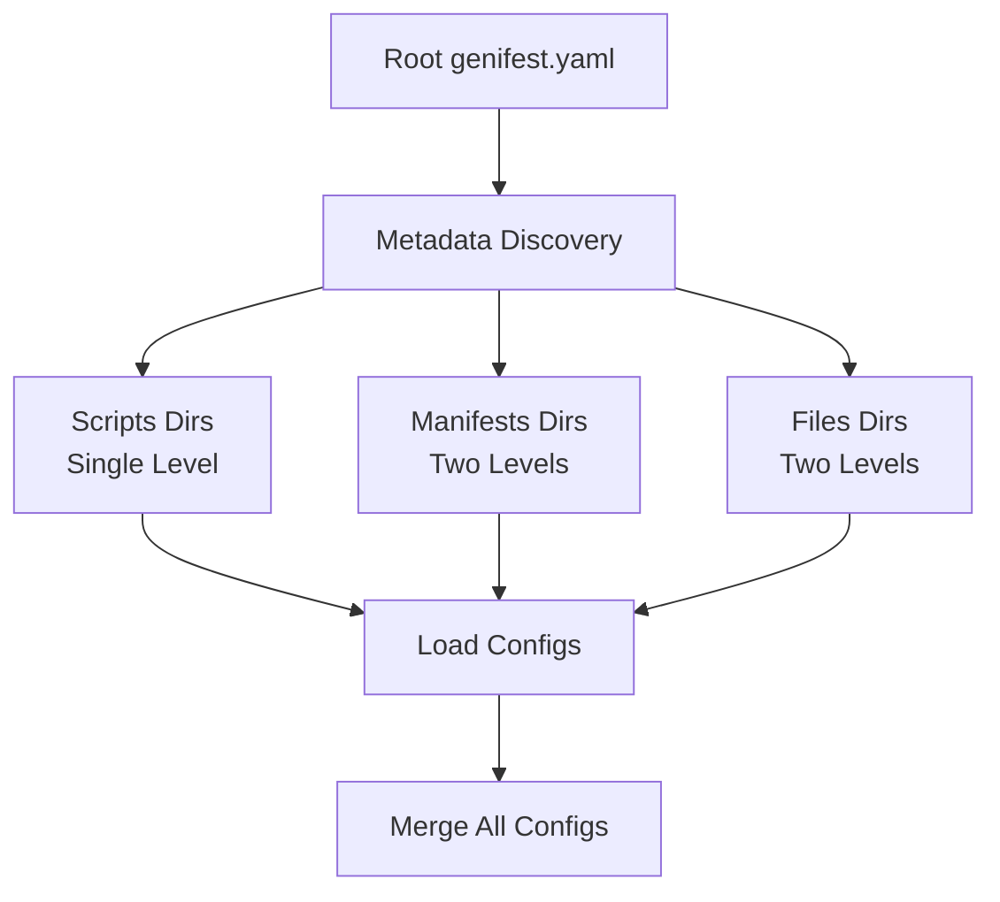

# Core Concepts

Genifest is built around several key concepts that work together to provide a flexible and powerful manifest generation system.

## Configuration Discovery

Genifest uses a **metadata-driven approach** to discover and load configuration files throughout your project.

### Discovery Process

1. **Root Discovery**: Starts by loading the root `genifest.yaml` file
2. **Metadata Processing**: Uses `scripts`, `manifests`, and `files` paths to discover additional directories
3. **Recursive Loading**: Loads configurations from discovered directories with depth limits
4. **Synthetic Configs**: Creates automatic configurations for directories without explicit `genifest.yaml` files



### Depth Limits

- **Scripts directories**: Single level only (no subdirectories)
- **Manifests directories**: Two levels deep
- **Files directories**: Two levels deep

This prevents infinite recursion while allowing reasonable project organization.

## Value Generation System

The heart of Genifest is its flexible value generation system using **ValueFrom** expressions.

### ValueFrom Types

=== "DefaultValue"

    Returns literal string values:
    ```yaml
    valueFrom:
      default:
        value: "literal-string"
    ```

=== "ArgumentRef"

    References variables from the current evaluation context:
    ```yaml
    valueFrom:
      argRef:
        name: "variable-name"
    ```

=== "BasicTemplate"

    Template strings with `${variable}` substitution:
    ```yaml
    valueFrom:
      template:
        string: "Hello ${name}!"
        variables:
          - name: "name"
            valueFrom:
              default:
                value: "World"
    ```

=== "FunctionCall"

    Calls named functions with arguments:
    ```yaml
    valueFrom:
      call:
        function: "get-replicas"
        args:
          - name: "environment"
            valueFrom:
              default:
                value: "production"
    ```

=== "ScriptExec"

    Executes scripts from the scripts directory:
    ```yaml
    valueFrom:
      script:
        exec: "build-image.sh"
        args:
          - name: "tag"
            valueFrom:
              default:
                value: "latest"
    ```

=== "FileInclusion"

    Includes content from files:
    ```yaml
    valueFrom:
      file:
        app: "myapp"  # optional subdirectory
        source: "config.yaml"
    ```

=== "CallPipeline"

    Chains multiple operations:
    ```yaml
    valueFrom:
      pipeline:
        - valueFrom:
            default:
              value: "initial"
          output: "step1"
        - valueFrom:
            template:
              string: "${step1}-processed"
              variables:
                - name: "step1"
                  valueFrom:
                    argRef:
                      name: "step1"
    ```

## Functions

Functions provide reusable value generation logic that can be called from changes.

### Function Definition

```yaml
functions:
  - name: "get-image-tag"
    params:
      - name: "service"
        required: true
      - name: "environment"
        required: true
    valueFrom:
      template:
        string: "${service}:${environment}-latest"
        variables:
          - name: "service"
            valueFrom:
              argRef:
                name: "service"
          - name: "environment"
            valueFrom:
              argRef:
                name: "environment"
```

### Function Scoping

Functions are scoped to their definition location and child paths:

- A function defined in the root config is available everywhere
- A function defined in `manifests/app1/` is only available to files in that directory
- This ensures proper encapsulation and prevents conflicts

## Change Orders

Changes define what modifications to apply to which files.

### Basic Structure

```yaml
changes:
  - tag: "production"                    # Optional tag for filtering
    fileSelector: "*-deployment.yaml"   # Which files to modify
    keySelector: ".spec.replicas"       # Which field to modify  
    valueFrom:                          # How to generate the value
      call:
        function: "get-replicas"
        args:
          - name: "environment"
            valueFrom:
              default:
                value: "production"
```

### File Selectors

File selectors use glob patterns to match files:

- `*.yaml` - All YAML files in the same directory
- `*-deployment.yaml` - All deployment files  
- `manifests/*/deployment.yaml` - Deployment files in any manifest subdirectory

### Key Selectors

Key selectors navigate YAML structure:

- `.spec.replicas` - Simple field access
- `.spec.template.spec.containers[0].image` - Nested with array access
- `.metadata.labels["app.kubernetes.io/name"]` - Field with special characters

## Tag System

Tags provide a way to selectively apply changes based on environment, change type, or any other criteria.

### Tag Usage

```yaml
changes:
  - tag: "production"
    # Change definition...
    
  - tag: "staging"  
    # Different change definition...
    
  - # No tag = always applied
    # Change definition...
```

### Tag Filtering

Control which changes to apply:

```bash
# Apply all changes
genifest run

# Apply only production changes
genifest run --include-tags production

# Apply all except staging
genifest run --exclude-tags staging

# Complex filtering with globs
genifest run --include-tags "prod*" --exclude-tags "test-*"
```

### Tag Logic

- **No flags**: All changes applied (tagged and untagged)
- **Include only**: Only changes matching include patterns
- **Exclude only**: All changes except those matching exclude patterns
- **Both flags**: Changes matching include but not exclude patterns

## Security Model

Genifest implements several security measures:

### Path Validation

- All paths are validated to stay within the configured `cloudHome`
- Path traversal attacks are prevented
- Scripts can only be executed from designated script directories

### Execution Isolation

- Scripts run with the `cloudHome` as the working directory
- Environment variables are isolated for script execution
- File inclusion is restricted to configured file directories

### Configuration Scoping

- Each configuration file only affects its subdirectories
- Functions and changes are properly scoped
- No global state pollution

## CloudHome Concept

The `cloudHome` defines the security boundary for a Genifest project:

```yaml
metadata:
  cloudHome: "/path/to/project"
```

- All file operations must stay within this boundary
- Scripts execute with this as the working directory
- File inclusions are relative to this path
- Path validation ensures security

## Immutable Contexts

The evaluation system uses immutable contexts to ensure safe concurrent operations:

- Each evaluation creates new contexts rather than modifying existing ones
- Variable scoping is preserved through context inheritance  
- No side effects between parallel evaluations
- Safe for use in concurrent environments

## Next Steps

- **[CLI Reference](cli-reference.md)** - Complete command-line interface documentation
- **[Configuration Files](configuration.md)** - Detailed configuration file format
- **[Value Generation](value-generation.md)** - Deep dive into ValueFrom expressions
- **[Tag Filtering](tag-filtering.md)** - Advanced tag filtering techniques